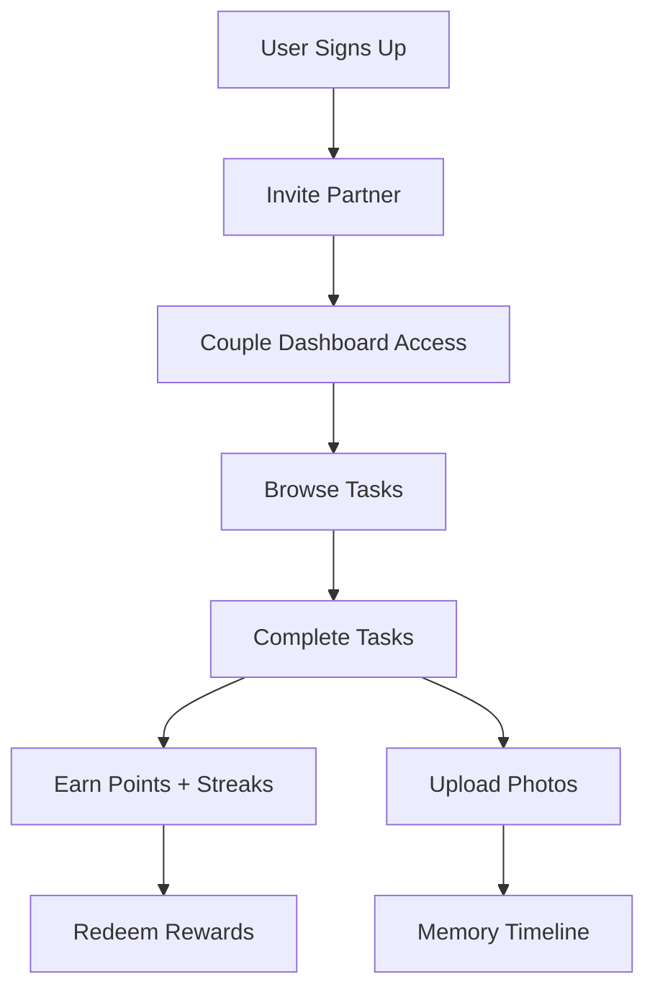

# 💕 Couples Relationship Dashboard

> A gamified web platform that helps couples build stronger relationships through positive habits, shared moments, and playful challenges.

[](LICENSE)
[](

---

## 🎯 What Is It?

A web-based platform for couples that **gamifies positive relationship habits**. Partners complete predefined or custom tasks (e.g., planning dates, small acts of care, quality time), earn points, maintain streaks, and redeem points for rewards. The product encourages consistency, appreciation, and fun in everyday relationships.

## 👥 Who Is It For?

Couples (dating, engaged, married) who want a light, playful way to stay intentional and connected.

## 💡 Core Problem Solved

People often want to be better partners but lack structure, reminders, and positive reinforcement. This platform turns small, healthy actions into visible progress **without making relationships transactional**.

---

## ✨ Key Features (MVP)

### 🔗 Couple Pairing
- Invite partner via unique link/code
- Secure couple connection
- Shared dashboard access

### ✅ Task System
- **Predefined tasks** with point values
- **Custom tasks** created by either partner
- Task categories (dates, care, communication, etc.)
- Photo attachments for completed tasks

### 🏆 Points & Streaks
- Points wallet for completed tasks
- Streak bonuses for consistency
- Visual progress tracking
- Gamified achievement system

### 🎁 Rewards Marketplace
- Predefined rewards catalog
- Custom rewards created by partners
- Points redemption system
- Reward history tracking

### 🎲 Surprise Quests
- Random relationship challenges
- Bonus point opportunities
- Keep things fresh and exciting

### 📸 Memory Timeline
- Shared memory wall
- View past completed tasks
- Photo gallery of relationship moments
- Nostalgic journey through shared experiences

---

## 🚀 How It Works (User Flow)



### Step-by-Step

1. **Sign Up** - Create your account
2. **Invite Partner** - Send unique pairing link
3. **Access Dashboard** - Shared couple workspace
4. **Complete Tasks** - Choose from predefined or create custom
5. **Earn Points** - Build streaks for bonus points
6. **Redeem Rewards** - Use points for special treats
7. **Build Memories** - Photos appear in shared timeline

---

## 🌟 Why It's Different

| Feature | Benefit |
|---------|--------|
| **Gamifies effort, not love** | Focus on actions, not emotions |
| **Consistency through streaks** | Builds healthy relationship habits |
| **Shared memory timeline** | Creates emotional connection |
| **Balanced design** | Avoids toxic scorekeeping |
| **Customizable system** | Adapts to each couple's unique needs |

---

## 🛠️ Tech Stack (High Level)

### Frontend
- **Framework**: React.js / Next.js
- **Styling**: Tailwind CSS / Styled Components
- **State Management**: Context API / Redux
- **Responsive Design**: Mobile-first approach

### Backend
- **Runtime**: Node.js
- **Framework**: Express.js / NestJS
- **Database**: PostgreSQL / MongoDB
- **Authentication**: JWT / OAuth
- **Image Storage**: Cloudinary / AWS S3

### Features
- User authentication & authorization
- Couple pairing logic
- Task management system
- Points & rewards engine
- Streak calculation
- Image upload & processing
- Real-time notifications

### DevOps
- **Hosting**: Vercel / Netlify (Frontend)
- **Backend**: Railway / Heroku / AWS
- **CI/CD**: GitHub Actions
- **Monitoring**: Sentry / LogRocket

---

## 📁 Project Structure

```
couples-relationship-dashboard/
├── client/                 # Frontend application
│   ├── src/
│   │   ├── components/    # Reusable UI components
│   │   ├── pages/         # Page components
│   │   ├── hooks/         # Custom React hooks
│   │   ├── context/       # Context providers
│   │   ├── utils/         # Helper functions
│   │   └── assets/        # Images, icons, etc.
│   └── package.json
├── server/                # Backend application
│   ├── src/
│   │   ├── controllers/   # Route controllers
│   │   ├── models/        # Database models
│   │   ├── routes/        # API routes
│   │   ├── middleware/    # Custom middleware
│   │   ├── services/      # Business logic
│   │   └── utils/         # Helper functions
│   └── package.json
├── docs/                  # Documentation
├── tests/                 # Test files
└── README.md
```

---

## 🎯 MVP Roadmap

### Phase 1: Core Setup ✅
- [x] Project initialization
- [x] Repository setup
- [x] Tech stack decision

### Phase 2: Authentication & Pairing
- [ ] User registration & login
- [ ] Couple pairing system
- [ ] Profile management

### Phase 3: Task System
- [ ] Predefined tasks database
- [ ] Custom task creation
- [ ] Task completion flow
- [ ] Image upload functionality

### Phase 4: Points & Rewards
- [ ] Points calculation engine
- [ ] Streak tracking system
- [ ] Rewards marketplace
- [ ] Redemption logic

### Phase 5: Memory Timeline
- [ ] Photo gallery view
- [ ] Timeline filtering
- [ ] Memory sharing features

### Phase 6: Polish & Launch
- [ ] UI/UX refinements
- [ ] Performance optimization
- [ ] Testing & bug fixes
- [ ] Deployment

---

## 🚦 Getting Started

### Prerequisites
```bash
Node.js (v18+)
npm or yarn
PostgreSQL / MongoDB
```

### Installation

```bash
# Clone the repository
git clone https://github.com/ani737/couples-relationship-dashboard.git
cd couples-relationship-dashboard

# Install dependencies (coming soon)
# npm install

# Set up environment variables
# cp .env.example .env

# Run development server
# npm run dev
```

---

## 🤝 Contributing

Contributions are welcome! This project is in early development.

1. Fork the repository
2. Create your feature branch (`git checkout -b feature/AmazingFeature`)
3. Commit your changes (`git commit -m 'Add some AmazingFeature'`)
4. Push to the branch (`git push origin feature/AmazingFeature`)
5. Open a Pull Request

---

## 📝 License

This project is licensed under the MIT License - see the [LICENSE](LICENSE) file for details.

---

## 💭 Philosophy

> "Great relationships aren't built on grand gestures alone, but on the small, consistent actions that show we care."

This platform is designed to:
- ✅ Encourage positive habits
- ✅ Celebrate small wins
- ✅ Build lasting memories
- ❌ NOT create unhealthy competition
- ❌ NOT reduce love to numbers
- ❌ NOT replace genuine connection

---

## 📧 Contact

Project Maintainer: [@ani737](https://github.com/ani737)

Project Link: [https://github.com/ani737/couples-relationship-dashboard](https://github.com/ani737/couples-relationship-dashboard)

---

## 🙏 Acknowledgments

- Inspired by couples seeking to strengthen their relationships
- Built with modern web technologies
- Designed with care and thoughtfulness

---

**Made with ❤️ for couples everywhere**
