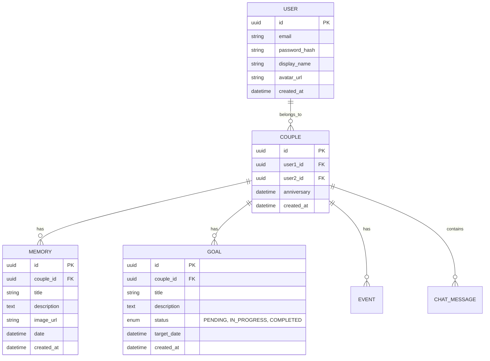

# Database Schema

## Entity Relationship Diagram (ERD)

## Tables

### Users
- `id`: UUID (Primary Key)
- `email`: String (Unique)
- `password_hash`: String
- `display_name`: String
- `avatar_url`: String
- `created_at`: Timestamp

### Couples
- `id`: UUID (Primary Key)
- `user1_id`: UUID (Foreign Key -> Users.id)
- `user2_id`: UUID (Foreign Key -> Users.id)
- `anniversary`: Date
- `created_at`: Timestamp

### Memories
- `id`: UUID (Primary Key)
- `couple_id`: UUID (Foreign Key -> Couples.id)
- `title`: String
- `description`: Text
- `image_url`: String
- `date`: Date
- `created_at`: Timestamp

### Goals
- `id`: UUID (Primary Key)
- `couple_id`: UUID (Foreign Key -> Couples.id)
- `title`: String
- `description`: Text
- `status`: Enum (PENDING, IN_PROGRESS, COMPLETED)
- `target_date`: Date
- `created_at`: Timestamp
