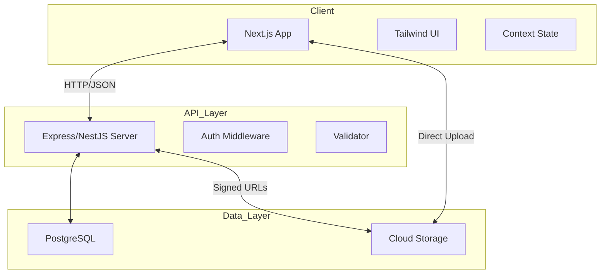

# 🏗️ Technical Architecture - Couples Relationship Dashboard

## 1. Overview
The Couples Relationship Dashboard is a full-stack web application designed with a mobile-first approach. It leverages modern web technologies to provide a responsive, real-time, and secure experience for couples.

---

## 2. Technology Stack

### Frontend
- **Framework**: [Next.js](https://nextjs.org/) (React)
  - *Reasoning*: Server-side rendering for performance, built-in routing, and excellent developer experience.
- **Styling**: [Tailwind CSS](https://tailwindcss.com/)
  - *Reasoning*: Utility-first approach for rapid, responsive UI development.
- **State Management**: [React Context API](https://reactjs.org/docs/context.html) or [Zustand](https://github.com/pmndrs/zustand)
  - *Reasoning*: Lightweight state management suitable for MVP needs.
- **Icons**: [Lucide React](https://lucide.dev/)
- **Charts**: [Recharts](https://recharts.org/) (for relationship insights)

### Backend
- **Runtime**: [Node.js](https://nodejs.org/)
- **Framework**: [Express.js](https://expressjs.com/) or [NestJS](https://nestjs.com/)
  - *Reasoning*: Robust ecosystem and fast performance for RESTful APIs.
- **Authentication**: [NextAuth.js](https://next-auth.js.org/) or [Firebase Auth](https://firebase.google.com/docs/auth)
  - *Reasoning*: Simplifies social logins (Google) and secure credential management.

### Database & Storage
- **Primary Database**: [PostgreSQL](https://www.postgresql.org/) (via [Prisma ORM](https://www.prisma.io/))
  - *Reasoning*: Relational structure is ideal for managing users, couples, and task linkages.
- **Media Storage**: [Cloudinary](https://cloudinary.com/) or [AWS S3](https://aws.amazon.com/s3/)
  - *Reasoning*: Scalable storage for task completion photos and memories.

---

## 3. High-Level Architecture

---

## 4. Key Architectural Decisions

### 4.1 Couple Pairing Logic
- **Invite Flow**: User A generates a unique token. This token is stored with an expiration.
- **Linking**: User B enters the token. The system updates both `user.couple_id` fields and creates a record in the `Couple` table.
- **Isolation**: Every database query for dashboard data *must* filter by `couple_id` to ensure strict privacy.

### 4.2 Streak Calculation Engine
- **Logic**: A background job or a "on-login" service calculates streaks by checking `TaskCompletion` records for consecutive days.
- **Grace Period**: Logic to handle timezones to ensure streaks don't break unfairly across global users.

### 4.3 Image Handling
- **Flow**: Frontend uploads to Cloudinary/S3 directly for speed. The resulting URL is then saved in the `TaskCompletion` table via the API.
- **Optimization**: Frontend will compress images before upload to reduce storage costs and improve performance.

---

## 5. Deployment Strategy

- **Frontend**: [Vercel](https://vercel.com/) (Optimized for Next.js)
- **Backend/API**: [Railway](https://railway.app/) or [Render](https://render.com/)
- **Database**: [Supabase](https://supabase.com/) or [Neon](https://neon.tech/) (Managed PostgreSQL)
- **CI/CD**: GitHub Actions for automated testing and deployment.

---

## 6. Security & Privacy
- **JWT**: Stateless authentication for API security.
- **HTTPS**: Encrypted communication for all data.
- **Data Privacy**: Couples can *only* see data where their `couple_id` matches. Admin panel access is restricted to specific `is_admin` flags.

---

## 7. Performance Targets
- **Lighthouse Score**: >90 for Performance, Accessibility, and Best Practices.
- **TTI (Time to Interactive)**: <2s on 4G connections.
- **Mobile responsiveness**: 100% functionality on viewport widths down to 320px.
